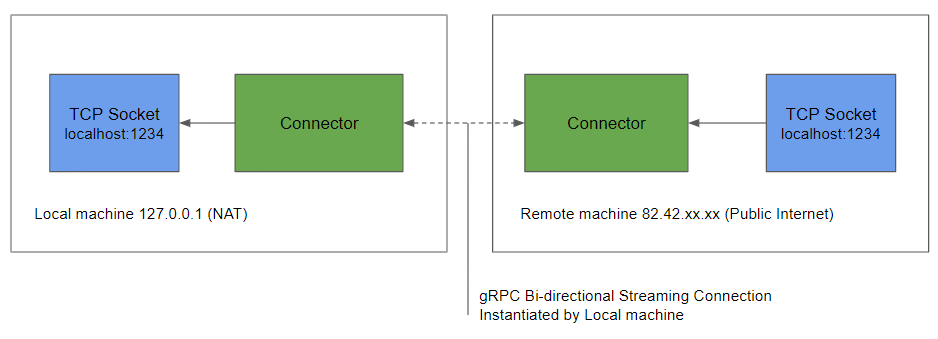

# Connector

[](https://codecov.io/gh/shipyard-run/connector)

Connector allows you to expose local TCP sockets to remote machines, and access TCP sockets running on remote machines locally. It works by tunneling the TCP connection over gRPC between two servers. Connector was build to be used with Shipyard but will work standalone to allow remote services access local applications. One use for this is when you are developing a local service and would like to connect it to a larger microservice environment which may be running in a remote Kubernetes cluster.

## Exposing local services to remote hosts
In the following example a remote machine running on the public internet can access a local TCP socket on a machine inside a private network. 

1. The local machine makes a call to the remote machine requesting to expose a local socket
1. A gRPC bi-directional stream is opened from the local machine to a publicly accessible remote server. Due to NAT issues, the local machine is not directly accessible from the remote machine. Opening an outward connection from the private to the public server bypasses this problem similar to a reverse SSH tunnel. 
1. The remote machine opens a local TCP Socket which can accept traffic.
1. When a connection is received by the Remote socket, the traffic is transparently proxied over the gRPC stream to the local machine.
1. The local machine sends the traffic to the final destination.



### Example
For example given you have the following setup:
* Connector running locally (127.0.0.1)
* Dev service running locally (127.0.0.1:9090)
* Remote Connector running on a publicly accessible server (82.42.12.21)

To expose the local dev service a POST request would be made to the local connectors JSON endpoint:
```
curl localhost:9091/expose -d \
  '{
    "name":"devservice", 
    "source_port": 9090, 
    "remote_server_addr": "82.42.12.21:9092", 
    "destination_addr": "localhost:9090",
    "type": "local"
  }'
```

## Running Connector
Connector is a single binary and can be run with the following command.

```shell
./connector
```

To configure the runtime parameters the following environment variables can be used

### Runtime Parameters
**BIND_ADD_GRPC** Bind address for the gRPC API
**BIND_ADD_HTTP** Bind address for the HTTP API
**LOG_LEVEL** Verbosity for output logs, (info, debug, trace)

## Exposing remote service locally 
It is also possible for Connector to expose TCP sockets running on a remote machine to the local host. This works in the same way as exposing remote services, the connection is always opened outward from the local machine to avoid NAT problems.

## Restful API
Connector uses a gRPC API however for convenience there is also a partial RESTful API.

### POST /expose
The expose endpoint allows you establish new connections between local and remote servers.

#### Parameters

**name**  
**type**: string

The name parameter is a human readable name for the exposed service.

**source_port**  
**type**: int

The port where the service will be accessible. If the service type is "local", this port will be a listener on the remote connector as it is exposing a local service. If the service type is "remote", this port will be a listener on the local connector as it is exposing a remote service.

**remote_server_addr**  
**type**: string

The address of the remote connectors gRPC API

**destination_addr**  
**type**: string

FQDN of the exposed service, this address is used by the terminating Connector to send the traffic to the destination. E.g. localhost or Kubernetes service name.

**type**
**type** string [local, remote]

#### Returns
String GUID for the created connection

Type specifies the direction of the traffic. A value of `local`, exposes a service on the local machine to the remote connector. A value of `remote` exposes a service on the remote machine to the local connector.

### GET /health
Return the health of the Connector.

## Testing
A simple test suite can be found in the folder `./test/simple`. These tests set up a pair of servers and test a local service exposed to a remote connector and a remote service exposed to a local connector. You can execute the tests using [Shipyard](https://shipyard.run):

```
shipyard test .
Feature: Remote Connector Simple
  In order to test the Remote Connector
  I should setup a remote and a local
  and try to access a service

  Scenario: Expose Local Service to Remote Server                           # /home/nicj/go/src/github.com/shipyard-run/connector/test/simple/test/connector.feature:6
    Given I have a running blueprint                                        # test.go:181 -> *CucumberRunner
    Then the following resources should be running                          # test.go:262 -> *CucumberRunner
      | name             | type      |
      | local_connector  | container |
      | remote_connector | container |
      | local_service    | container |
    When I run the script                                                   # test.go:479 -> *CucumberRunner
      ```
      #!/bin/bash
      echo "Expose local service to remote server"
      curl localhost:9091/expose -d \
        '{
          "name":"test", 
          "local_port": 9094, 
          "remote_port": 13000, 
          "remote_server_addr": "remote-connector.container.shipyard.run:9092", 
          "service_addr": "local-service.container.shipyard.run:9094",
          "type": "local"
        }'
      ```
    Then I expect the exit code to be 0                                     # test.go:517 -> *CucumberRunner
    And a HTTP call to "http://localhost:13000" should result in status 200 # test.go:350 -> *CucumberRunner


  Scenario: Expose Remote Service to Localhost                              # /home/nicj/go/src/github.com/shipyard-run/connector/test/simple/test/connector.feature:30
    Given I have a running blueprint                                        # test.go:181 -> *CucumberRunner
    Then the following resources should be running                          # test.go:262 -> *CucumberRunner
      | name             | type      |
      | local_connector  | container |
      | remote_connector | container |
      | remote_service   | container |
    When I run the script                                                   # test.go:479 -> *CucumberRunner
      ```
      #!/bin/bash
      echo "Expose local service to remote server"
      curl localhost:9091/expose -d \
        '{
          "name":"test", 
          "local_port": 12000, 
          "remote_port": 9095, 
          "remote_server_addr": "remote-connector.container.shipyard.run:9092", 
          "service_addr": "remote-service.container.shipyard.run:9095",
          "type": "remote"
        }'
      ```
    Then I expect the exit code to be 0                                     # test.go:517 -> *CucumberRunner
    And a HTTP call to "http://localhost:12000" should result in status 200 # test.go:350 -> *CucumberRunner


2 scenarios (2 passed)
10 steps (10 passed)
39.4207831s
```